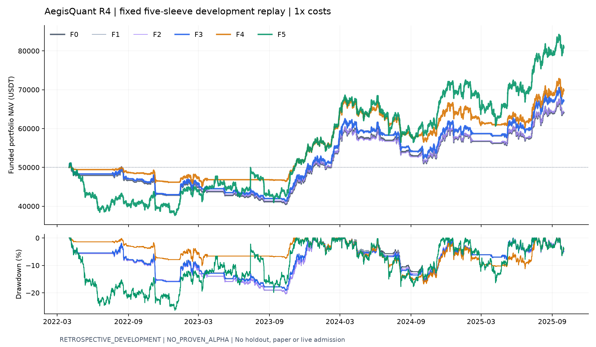

# AegisQuant R4 研究结果

**NO_PROVEN_ALPHA。** R4 六个固定配置及全部成本压力已实际回放；工程通过，策略未获晋级。所有结果为 `RETROSPECTIVE_DEVELOPMENT`。生产 CASH、selected_model_id=null，ML、纸面、实盘及订单提交保持关闭。

测试：2022-04-01 至 2025-10-01（不含结束时点），五币 BTC/ETH/BNB/SOL/XRP；各子账户初始 10,000 USDT，总资本 50,000，现金收益 0，无杠杆或跨币转资。未重新拟合收益模型或校准器，未访问最终留出集。

| 配置 | 期末 USDT | CAGR | Sharpe | 最大回撤 | 成本 USDT | 成交 | 平均暴露 |
|---|---:|---:|---:|---:|---:|---:|---:|
| F0 | 64,104.14 | 7.35% | 0.633 | 20.43% | 2,912.38 | 2022 | 19.979% |
| F1 | 66,882.62 | 8.66% | 0.727 | 19.04% | 2,253.58 | 1915 | 19.892% |
| F2 | 64,340.27 | 7.47% | 0.640 | 20.38% | 2,614.83 | 2002 | 20.059% |
| F3 | 67,179.11 | 8.80% | 0.736 | 19.18% | 1,949.02 | 1905 | 19.973% |
| F4 | 69,899.00 | 10.04% | 0.871 | 16.79% | 1,307.53 | 1978 | 18.351% |
| F5 | 81,031.84 | 14.78% | 0.790 | 26.40% | 2,096.44 | 3682 | 39.958% |

F0=原 A1；F1=仅加缓冲；F2=仅连续运行；F3=缓冲＋连续运行（预注册主候选）；F4=固定三周期等权信号；F5=同风险规则的长期持有信号。F4/F5 共同使用 F3 缓冲、费用与硬约束。

## 缓冲与季度边界的实际影响

F1−F0：期末增加 2,778.48 USDT，实际成本减少 658.80。F2−F0：期末增加 236.13 USDT，成本减少 297.55。

F3−F0：增加 3,074.97 USDT，成本减少 963.36，成交从 2022 降到 1905，名义换手从 1,836,504.90 降到 1,219,545.55 USDT。收益变化还包含目标数量、持有机会和复利路径，不能全部归为费用节省。

季度退出取消后，F2 的闭合周期由 104 减为 82；现金、数量、成本基础、趋势确认、风险历史、未决订单和调仓时钟在单次运行中保留。因子交互 `F3−F2−F1+F0` 为 60.36 USDT，其 95% 区间为 [-318.29547274030455, 518.2284845946145]；没有把累计收益率直接相加。

风险并非全面改善：F0/F3 实现年化波动分别为 12.44%/12.53%，最差 4h 收益为 -3.66%/-3.67%，4h CVaR95 为 -0.70%/-0.70%；最长回撤持续 629.0/625.3 天。原硬约束保持，20% 是逐币目标而非已验证的组合风险上限。

## A1 2,022 次成交归因

| 首要原因 | 订单 | 成交 | 名义金额 USDT | 实际成本 USDT |
|---|---:|---:|---:|---:|
| ORDINARY_RISK_RESTORE | 924 | 924 | 470,389.21 | 733.00 |
| ORDINARY_RISK_REDUCE | 890 | 890 | 501,262.97 | 816.24 |
| FIRST_TREND_ENTRY | 104 | 104 | 439,354.98 | 689.33 |
| TREND_EXIT | 79 | 79 | 303,512.27 | 484.41 |
| QUARTER_EXIT | 23 | 23 | 111,069.16 | 172.25 |
| EVALUATION_END | 2 | 2 | 10,916.31 | 17.14 |

全部成交逐条对应 `execution_reason_attribution.parquet`。部分成交与持仓周期分别统计，成交累积出的周期数与原引擎一致。订单金额分位数、24/48 小时内反向调仓金额见原因汇总和 `risk_resize_reversals.parquet`；反向调仓只是诊断，不自动等于无效交易。

审计未确认需要独立 BUGFIX_BRIDGE 的策略缺陷：A1 HOLD 保持实际数量，已取消旧路径额外 0.99 缩放；现金继承已有，A7 经济退出未开启。普通调仓沿用实际的“上次提交后 86,400 秒”检查，不擅改成 UTC 固定日历。缓冲只补充原经济调仓带，交易到最近边界；硬风险、趋势退出、首次入场和原订单管理器保持各自职责。

## 信号挑战者与持有基准

F4−F3 期末差 2,719.89 USDT；F3−F5 差 -13,852.73；F4−F5 差 -11,132.84。相同事前风险规则不保证实现波动或暴露相同；上述表格同时列出风险和资金使用，未做后验曲线放大。

F4 使用版本化 10/40、20/80、40/160 天政策，共享一个风险预算，原 10/40 版本保持历史语义。任一窗口未完成因果预热时整组弃权，不缩短窗口或重分配预算。逐子信号 readiness、共同有效机会轴上的实际资金 PnL 分解见 `signal_readiness_diagnostics.parquet` 和 `common_ready_intervals.parquet`；这是两条完整资金路径的描述性切片，不是删掉不利时段后的可交易重跑。

共同就绪时段的 F4−F3 实际路径损益差合计为 -816.15 USDT；三组未全部就绪时段合计为 3,536.04 USDT。因此总增益主要出现在 F4 因预热或缺口恢复而减少参与的时段，不能归为已证明的多周期信号增量。这些切片包含退出费用及此前复利路径的影响。

F4−F3 最终美元差的配对 95% 区间为 [-6,951.94, 11,721.79] USDT，覆盖负值；Holm 校正 p=1.0000。F4 的 Sharpe/Calmar 点估计较好，但尚未证明增量，更未超过持有基准的净利润。

## 成本压力

| 配置 | 模式 | 倍率 | 期末 USDT | 实际/影子成本 USDT | 成交 | 拒单 |
|---|---|---:|---:|---:|---:|---:|
| F0 | FROZEN_ORDERS_FUNDED | 1.5 | 58,803.12 | 4,215.61 | 1996 | 37 |
| F0 | FROZEN_ORDERS_FUNDED | 2 | 57,403.46 | 5,618.79 | 1995 | 39 |
| F0 | REDECIDE_FUNDED | 1 | 64,104.14 | 2,912.38 | 2022 | 0 |
| F0 | REDECIDE_FUNDED | 1.5 | 62,326.44 | 4,300.66 | 2022 | 0 |
| F0 | REDECIDE_FUNDED | 2 | 60,614.88 | 5,644.46 | 2022 | 0 |
| F0 | SAME_FILL_SHADOW | 1 | 64,104.14 | 2,912.38 | 2022 | 0 |
| F0 | SAME_FILL_SHADOW | 1.5 | 62,647.99 | 4,368.53 | 2022 | 0 |
| F0 | SAME_FILL_SHADOW | 2 | 61,191.86 | 5,824.66 | 2022 | 0 |
| F1 | FROZEN_ORDERS_FUNDED | 1.5 | 61,858.38 | 3,241.35 | 1884 | 34 |
| F1 | FROZEN_ORDERS_FUNDED | 2 | 60,777.97 | 4,321.76 | 1884 | 34 |
| F1 | REDECIDE_FUNDED | 1 | 66,882.62 | 2,253.58 | 1915 | 0 |
| F1 | REDECIDE_FUNDED | 1.5 | 65,481.64 | 3,343.03 | 1918 | 0 |
| F1 | REDECIDE_FUNDED | 2 | 64,092.72 | 4,404.71 | 1918 | 0 |
| F1 | SAME_FILL_SHADOW | 1 | 66,882.62 | 2,253.58 | 1915 | 0 |
| F1 | SAME_FILL_SHADOW | 1.5 | 65,755.87 | 3,380.33 | 1915 | 0 |
| F1 | SAME_FILL_SHADOW | 2 | 64,629.14 | 4,507.06 | 1915 | 0 |
| F2 | FROZEN_ORDERS_FUNDED | 1.5 | 59,701.07 | 3,826.51 | 1984 | 28 |
| F2 | FROZEN_ORDERS_FUNDED | 2 | 58,454.92 | 5,098.33 | 1983 | 30 |
| F2 | REDECIDE_FUNDED | 1 | 64,340.27 | 2,614.83 | 2002 | 0 |
| F2 | REDECIDE_FUNDED | 1.5 | 62,737.29 | 3,867.77 | 2002 | 0 |
| F2 | REDECIDE_FUNDED | 2 | 61,168.12 | 5,085.05 | 2003 | 0 |
| F2 | SAME_FILL_SHADOW | 1 | 64,340.27 | 2,614.83 | 2002 | 0 |
| F2 | SAME_FILL_SHADOW | 1.5 | 63,032.89 | 3,922.21 | 2002 | 0 |
| F2 | SAME_FILL_SHADOW | 2 | 61,725.54 | 5,229.56 | 2002 | 0 |
| F3 | FROZEN_ORDERS_FUNDED | 1.5 | 63,076.84 | 2,857.76 | 1886 | 21 |
| F3 | FROZEN_ORDERS_FUNDED | 2 | 62,124.30 | 3,810.30 | 1886 | 21 |
| F3 | REDECIDE_FUNDED | 1 | 67,179.11 | 1,949.02 | 1905 | 0 |
| F3 | REDECIDE_FUNDED | 1.5 | 65,931.73 | 2,893.38 | 1906 | 0 |
| F3 | REDECIDE_FUNDED | 2 | 64,723.32 | 3,820.06 | 1906 | 0 |
| F3 | SAME_FILL_SHADOW | 1 | 67,179.11 | 1,949.02 | 1905 | 0 |
| F3 | SAME_FILL_SHADOW | 1.5 | 66,204.64 | 2,923.49 | 1905 | 0 |
| F3 | SAME_FILL_SHADOW | 2 | 65,230.19 | 3,897.94 | 1905 | 0 |
| F4 | FROZEN_ORDERS_FUNDED | 1.5 | 69,245.27 | 1,961.26 | 1978 | 0 |
| F4 | FROZEN_ORDERS_FUNDED | 2 | 68,591.57 | 2,614.97 | 1978 | 0 |
| F4 | REDECIDE_FUNDED | 1 | 69,899.00 | 1,307.53 | 1978 | 0 |
| F4 | REDECIDE_FUNDED | 1.5 | 69,117.72 | 1,949.06 | 1978 | 0 |
| F4 | REDECIDE_FUNDED | 2 | 68,343.83 | 2,582.58 | 1976 | 0 |
| F4 | SAME_FILL_SHADOW | 1 | 69,899.00 | 1,307.53 | 1978 | 0 |
| F4 | SAME_FILL_SHADOW | 1.5 | 69,245.27 | 1,961.26 | 1978 | 0 |
| F4 | SAME_FILL_SHADOW | 2 | 68,591.57 | 2,614.97 | 1978 | 0 |
| F5 | FROZEN_ORDERS_FUNDED | 1.5 | 79,983.69 | 3,144.59 | 3682 | 0 |
| F5 | FROZEN_ORDERS_FUNDED | 2 | 78,935.58 | 4,192.70 | 3682 | 0 |
| F5 | REDECIDE_FUNDED | 1 | 81,031.84 | 2,096.44 | 3682 | 0 |
| F5 | REDECIDE_FUNDED | 1.5 | 79,485.04 | 3,110.70 | 3684 | 0 |
| F5 | REDECIDE_FUNDED | 2 | 77,966.11 | 4,102.86 | 3685 | 0 |
| F5 | SAME_FILL_SHADOW | 1 | 81,031.84 | 2,096.44 | 3682 | 0 |
| F5 | SAME_FILL_SHADOW | 1.5 | 79,983.69 | 3,144.59 | 3682 | 0 |
| F5 | SAME_FILL_SHADOW | 2 | 78,935.58 | 4,192.70 | 3682 | 0 |

SAME_FILL_SHADOW 固定同时间、同数量、同参考价格，只机械调整非负费用且不再投资差额；它不可交易。FROZEN_ORDERS_FUNDED 固定原订单，继续执行现金、库存、精度和拒单约束。REDECIDE_FUNDED 使用相应成本重新决策。费用按实际订单/成交名义金额计算，手续费基数含成交不利价格；未降低基础 10 bps 费率。

1× 成本的三种身份共用原基础成交；1.5×/2× 分别计算影子费用、冻结订单资金回放和完整重决策，无重复搜索或按压力结果选参。

每个实际运行同时保存最终退出决策时 MTM、最终退出参考价上的退出前 MTM 和成本化退出后 NAV。剩余仓位在评估期内最后一个合资格 next open 处理，不取结束时点之后的价格；详见每个场景的 `summary.json`。

## A3/A7 冻结机会与资金使用

最新冻结 A3/A7 仍为旧有效预测的对照，没有重新校准。A3 同时改变模型入场和成本门槛，其总差异不能单独归给 XGBoost。原冻结标签为下一根入场、第六根开盘退出，实际持有 5 个 4h 区间（20h），没有改称趋势持有期预测。

| 对照 | 接受/推迟/完全拒绝/全段不可用 | 固定名义影子漏掉正收益 | 固定名义影子避开负收益 |
|---|---|---:|---:|
| A3 | {'SKIPPED_UNAVAILABLE': 7, 'REJECTED_ENTIRE_OPPORTUNITY': 20, 'DELAYED': 46, 'ACCEPTED': 31} | 3,683.65 | 1,914.45 |
| A7 | {'ACCEPTED': 2, 'SKIPPED_UNAVAILABLE': 7, 'DELAYED': 12, 'REJECTED_ENTIRE_OPPORTUNITY': 83} | 13,039.52 | 5,665.32 |

每个 A1 趋势机会采用固定 1,000 USDT 名义的后视机会影子诊断。影子成本/时轴与真实复利账户分开标识，不能把上表当作实际可交易避亏、错失金额，或相减后解释完整路径差。完整账本区间 PnL、入场延迟、持有时间、模型不可用原因和权重见 `opportunity_attribution.parquet`。

A7 的完整组合日历暴露按每个时点 sum(position_value)/sum(equity) 再求平均，复核为约 0.2644%；没有百分比二次除以 100。资金拆解逐项给出过滤器分母，模型覆盖率特指 LONG 候选时点。预估风险均值与实现波动之差仅为描述性诊断，没有用乘数均值乘积或暴露反向放大制造收益。

## 统计、验证及停止结论

共同 UTC 每日时轴，10,000 次配对区块重采样，固定 seed=20260908。预注册规则根据收益与平方收益依赖自动选取最大区块长度，本次为 28 天，所有币种与策略保留同时间共动。方法依据 [arch 官方区块长度说明](https://arch.readthedocs.io/en/latest/bootstrap/generated/arch.bootstrap.optimal_block_length.html)，使用项目原有配对圆形区块采样器；完整结果见 `paired_statistics.json`。

F3−F0 未校正的最终美元差 95% 区间为 [272.58306704909495, 6035.8802943187075] USDT；配对复合收益差区间为 [0.17%, 17.30%]。单侧均值检验 p=0.0241，本轮预注册比较 Holm 校正后 p=0.1472。区间反映已使用开发历史的不确定性，不能替代盲测。

工程：原 A1 70 分区精确复现，集成后 F0 再次逐单、逐成交及完整 MTM 核验；矩阵共 800 次权威引擎运行、150 个币种成本场景；1,156 项全仓测试及 40 项参考组件测试通过。另完成 BTC 两种连续政策的 28 次真实季度事件日志保存/恢复核验，范围详见 boundary_state_checks。原引擎不提供原位增量 session restore；研究恢复通过已见事件日志重放重建全部状态，未另写账本或把结果状态强塞回账户。

F3 的 Sharpe、Calmar、正收益季度比例及季度收益中位数仍未达到原经济门槛；尾部风险亦无全面改善。F4 虽通过 Sharpe/Calmar 点估计门槛，仍仅 6/14 季盈利（低于 60%），季度收益中位数 -0.079%，不满足大于零要求。完整历次独立研究试验历史仍不足，不能拿本轮六个配置代替 DSR/PBO 所需历史。没有确认此前未使用且满 12 个月的最终留出集，HOLDOUT_SUPPORTED 不成立。保留工程实现和全部失败/成功证据，停止扩展参数、币种或模型搜索，结论维持 NO_PROVEN_ALPHA。

阶段记录：PLANNED → IMPLEMENTED → UNIT_TESTED → ENGINE_INTEGRATED → REPLAYED；没有标记 HOLDOUT_SUPPORTED，也没有把回测实现完成当成交易授权。数据仍为固定存活五币、历史费率/规则/盘口/容量未经真实执行材料证明的代理回放。

## 可复现材料

`audit_manifest.json` / `effective_config.json` / `effective_runtime_arguments.json` 记录源码、配置、数据和实际函数参数；`implementation_before/` 保留原用户工作区源码，`implementation/` 为冻结研究实现。新归因脚本及验证脚本另存 `reporting_implementation/`；文档修改前副本为 `project_documents_before/`，冻结 A1/A3/A7 必要账本副本为 `baseline_reference/`。运行原始结果保留在 `runs/`，原工件未覆盖。

顺序入口：`python -m scripts.run_alpha_r4 register --output <new-dir>`；`baseline`；`matrix`；完成工程与边界验证后 `challengers`（或双进程调度器）；`python -m scripts.summarize_alpha_r4 --output <dir>`；`python -m scripts.finalize_alpha_r4 report --output <dir>`。重新启动研究应使用新目录并登记，不能覆盖已有证据。

自动归档结果单独记录在 `validation/local_git_archive.json`；归档阻塞不改变源工作区或研究结果。证据包采用明确文件清单，不含 .env、私钥、cookie 或无关原始行情。

本轮自动归档实际退出码为 2，既有裸库仍含 codex-archive 分支。归档脚本在分支预检停止，未生成新提交，未迁移或删除历史；源仓库 main 保持 dirty，原用户修改保留。现有本地 Skill 规定“已有非 main 归档……必须保留并报错”，本任务书 §11 同样要求归档失败只停止归档动作。完整命令与错误保存在上述 JSON/TXT，主研究证据不依赖提交成功。
