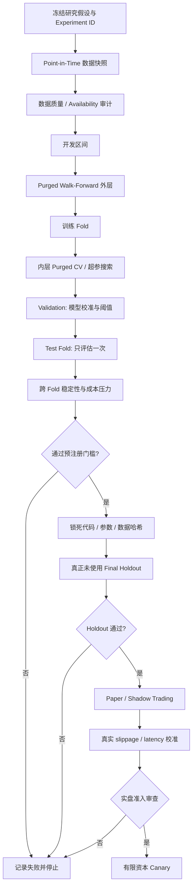

# AegisQuant 量化系统深度审计与盈利稳定性整改报告

## 执行摘要

本次审计以两套相互补充的证据为准：一是 GitHub 仓库 `tORHANSxd/AegisQuant` 的 `main` 基线，审计时对应提交 `469f559479401903714a969615ebdcf1988de950`；二是你提供的 `AegisQuant_R4_Evidence_20260908_v1.zip`，其中冻结了 R4 的实际研究实现、配置、回测产物、成本压力结果、统计检验、测试日志和修改前源码。GitHub 基线明确把 Alpha v4 数据标记为 `PREVIOUSLY_USED_DEVELOPMENT_DATA`，并要求最终留出集必须至少十二个月且此前未使用。fileciteturn4file0L2-L2 R4 证据包最终结论本身也是 **`NO_PROVEN_ALPHA`**，不是“已有 alpha 但参数没调好”。

**核心判断：AegisQuant 当前无法稳定盈利的根本原因不是单个代码 bug，而是“信号优势不足 + 风险调仓过度交易 + 研究级样本污染/选择偏差 + 交易成本证据不足”四者叠加。机器学习并不是当前最应该继续加复杂度的地方。**

最关键的实证事实如下。

| 优先级 | 根因 | 最强证据 | 判断 |
|---|---|---|---|
| **P0** | **策略没有证明存在独立于市场 beta 的稳定 alpha** | F5 长期持有基准期末 **81,031.84 USDT**，显著高于 F3 **67,179.11**、F4 **69,899.00**；F3−F5 = **−13,852.73** | 当前盈利主要更像“长期风险资产暴露”，而非择时 alpha |
| **P0** | **研究级样本外已经被反复使用，不存在真正最终盲测** | 配置明确将数据标记为 `PREVIOUSLY_USED_DEVELOPMENT_DATA`；R4 `final_holdout_access_count=0`，但原因是根本没有确认满足条件的 ≥12 月未用数据 | 当前 Sharpe、CAGR、bootstrap CI 都不能作为生产晋级证据 |
| **P0** | **波动率目标调仓制造大量无效换手** | F0 的 2,022 笔成交中，924 笔 `ORDINARY_RISK_RESTORE` + 890 笔 `ORDINARY_RISK_REDUCE`，合计 **1,814 笔，即 89.7%** | 系统绝大多数交易不是 alpha 入/出场，而是在追逐短期波动率变化 |
| **P0** | **ML 经济过滤器目标与真实交易目标错配，且严重压缩有效市场参与** | A3 漏掉正收益机会影子 3,683.65，只避开 1,914.45 负收益；A7 漏 13,039.52，只避 5,665.32；A7 平均暴露仅约 **0.2644%** | ML gate 的主要效果是“不交易”，不是提高条件期望收益 |
| **P0** | **成本与执行模型仍是代理模型，不是历史真实执行证据** | 配置直接声明 `preregistered_proxy_not_verified_historical_fee_tier_or_orderbook`，规则亦标记 `declared_proxy_not_verified_historical_exchange_rules` | 成本压力测试有价值，但不能证明实盘可实现 |
| **P1** | **存活者偏差和资产选择偏差** | 多资产配置明确写有 `illustrative_surviving_assets_not_point_in_time_whole_market_universe`，仅固定 BTC/ETH/BNB/SOL/XRP。fileciteturn3file0L2-L2 | 五个后来存活并高度成功的币种会高估长期策略的可实现性 |
| **P1** | **风险预算不是组合级风险预算** | R4 风险审计写明“independent sleeve target 20%; no portfolio covariance target” | 五个高度相关风险资产可能同时放大 crypto beta |
| **P1** | **参数和模型的统计自由度仍大于可用独立数据量** | 完整历史独立试验记录不足，R4 明确无法计算有意义的 DSR/PBO；F3 未校正 p=0.0241，Holm 后变成 **0.1472** | 原本看起来“显著”的改进经过多重比较后并不显著 |
| **P1** | **F4 的改进并不能归因于多周期信号本身** | F4−F3 全期 +2,719.89，但共同就绪区间实际上 **−816.15**；+3,536.04 来自部分信号未预热/缺口恢复阶段的较低参与 | F4 的漂亮 Sharpe 很大程度上是暴露路径变化 |
| **P2** | 工程正确性总体较好，不是主要矛盾 | R4 保存的全仓测试日志为 **1,156 passed**；额外 40 个 buffered-target 参考测试全部通过 | 应保留现有因果约束、Decimal、fail-closed 与审计设计，而不是推倒重写 |

R4 实际测试期为 **2022-04-01 至 2025-10-01**，资产为 BTC/ETH/BNB/SOL/XRP 现货，每个 sleeve 10,000 USDT，总初始资金 50,000 USDT。因此用户预设的“若未指定则按股票/期货、日频或更低”在这里并不适用：代码实际运行的是 **4 小时 bar、日级风险复核、Binance Spot 风格市场**。策略配置明确 `frequency_seconds: 14400`、`risk_frequency_seconds: 86400`、禁止做空、最大杠杆 1。fileciteturn5file0L2-L2

最终建议不是继续优化 XGBoost，而是按以下顺序整改：

> **先封存真正的最终盲测 → 建立 point-in-time universe → 以 F5/简单趋势作为基准重新定义 alpha → 消灭波动率调仓 churn → 重建真实成本模型 → 做组合级风险预算 → 再重新设计 ML 标签与 nested walk-forward。**

在这些条件满足前，**production policy 应继续保持 CASH，`production_ml_enabled=false`、`order_submission_enabled=false` 是正确状态**。相关研究配置目前也确实保持关闭。fileciteturn3file0L2-L2

## 审计范围、系统结构与测试复现

### 审计覆盖与未指定项

提供的 R4 ZIP 共包含 1,135 个条目，冻结研究实现约包含 354 个 Python 文件，以及研究 YAML、运行结果、Parquet 账本、统计结果与测试材料。此次进行了仓库级静态模式扫描，并重点逐函数审查了 alpha 直接执行链：

`数据下载 → 1h 清洗/聚合 → 4h causal feature → walk-forward → ML forecast/calibration → trend/economic gate → vol sizing → buffered target → cost/latency → event backtest → statistical validation`

GitHub 本身也包含广泛的 acceptance、alpha_v4、architecture、chaos、contract、execution、integration 等测试目录。fileciteturn2file0L2-L2

在全冻结实现中针对常见泄露模式进行了静态检查，未发现 `shift(-n)`、backfill、centered rolling、随机 `train_test_split`、普通 `KFold`、`shuffle=True` 等明显未来泄露写法。因此，**“代码里直接偷看未来价格”并不是当前最强问题**。相反，现有 CAT 特征对 bar availability 做了严格约束，要求 bar 已完成且 `available_time` 单调递增；rolling/EMA 为因果计算，scaler 也只允许训练样本早于 validation。GitHub 对应实现可直接复核。fileciteturn7file0L2-L2

这点非常重要：应避免把所有亏损归咎于“look-ahead bug”。当前真正严重的是**研究过程层面的信息污染**，而非低级数组索引泄露。

以下项目在现有证据中仍属于“未指定”或未被充分证明：

| 项目 | 状态 |
|---|---|
| 未来真实交易所账户手续费等级 | **未指定/未历史化** |
| 逐时历史 bid/ask 或 L2 order book | **未指定/未提供** |
| 实盘 API round-trip latency 分布 | **未指定** |
| 历史真实下单与成交日志 | **未提供** |
| Binance 各历史时期真实 tick/step/min-notional 版本 | **未验证，以代理规则代替** |
| 完整 point-in-time 可交易 universe | **未提供** |
| 真正未使用 ≥12 个月 final holdout | **不存在已确认数据** |
| 可用于 DSR/PBO 的完整历史独立研究试验 registry | **不足** |
| 策略容量上限 | **未验证** |
| 税务 | **未指定** |
| 具体实盘司法辖区及监管主体 | **未指定** |
| 股票/期货交易支持下的公司行动、换月、涨跌停等 | 当前 Alpha v4 **不适用；代码本次实证为 crypto spot** |

### 当前数据与回测设计

多资产配置固定五个现货资产，并明确承认这只是“存活资产示例”，不是 point-in-time 全市场 universe。fileciteturn3file0L2-L2 BTC/ETH 使用已经保存的公共历史，BNB/SOL/XRP 通过 Binance Public REST 下载；证据包的下载逻辑也记录数据 hash。

数据审计代码没有伪造缺失 bar：它检查重复 open、顺序、缺小时、异常 close time、零成交量，并尝试用 Binance 官方 archive + checksum 交叉核验，且明确 `gaps_filled=False`。这是一个值得保留的工程习惯。

但**原始市场 CSV 本身没有完整打包进这份证据 ZIP**；证据包保留的是哈希、下载 manifest 和冻结结果。因此本报告能够审查数据生成逻辑和已有质量审计，不能从 ZIP 独立逐行重新计算所有 OHLCV。对此应明确标记为：**原始数据独立复核不完整**。

### 训练与样本外机制

现有 walk-forward 在代码层面比很多业余系统严谨：12 个月 train、3 个月 validation、3 个月 test、每 3 个月滚动；purge 至少覆盖最大预测 horizon，embargo 至少一根 4h bar，而且 test fold 不重叠。fileciteturn6file0L2-L2

问题发生在更高一层。

研究配置把整个数据区间写成：

```yaml
data_classification: PREVIOUSLY_USED_DEVELOPMENT_DATA
first_train_start: 2021-01-01
development_end: 2025-10-01
final_holdout_minimum_months: 12
missing_evidence: FAIL_CLOSED
```

fileciteturn4file0L2-L2

因此，fold 内的 test 可以叫“局部 OOS”，却已经不能被当作**整个研究项目层面的真正 OOS**。当研究人员已经看过 F0/A1/A3/A7，再设计 F1/F2/F3/F4/F5 并继续在 2022–2025 上比较时，这段历史已经参与了策略研发反馈环。

这是典型的**research overfitting / adaptive overfitting**：算法本身没有看未来，但研究者看过测试结果后再修改算法，也会把测试集转化为训练信息。

### 回测结果复核

冻结 R4 结果如下，均为 1× 成本、`REDECIDE_FUNDED`：

| 配置 | 解释 | 期末净值 | CAGR | Sharpe | 最大回撤 | 成本 | 成交 | 平均资金暴露 |
|---|---|---:|---:|---:|---:|---:|---:|---:|
| F0 | 原 A1 | 64,104 | 7.35% | 0.633 | 20.43% | 2,912 | 2,022 | 19.98% |
| F1 | F0 + buffer | 66,883 | 8.66% | 0.727 | 19.04% | 2,254 | 1,915 | 19.89% |
| F2 | F0 + continuous run | 64,340 | 7.47% | 0.640 | 20.38% | 2,615 | 2,002 | 20.06% |
| F3 | buffer + continuous | 67,179 | 8.80% | 0.736 | 19.18% | 1,949 | 1,905 | 19.97% |
| F4 | 三周期等权 trend | 69,899 | 10.04% | **0.871** | **16.79%** | **1,308** | 1,978 | 18.35% |
| F5 | long-hold signal | **81,032** | **14.78%** | 0.790 | 26.40% | 2,096 | 3,682 | **39.96%** |

证据包：`artifacts/alpha_r4/20260908_v1/go_no_go.md:L3-L16`。

这里最不能忽略的是 **F5**。同一风险规则下，一个几乎不做趋势择时的 long-hold 方案获得了最高净利润。F4 的 Sharpe 虽高于 F5，但净利润仍少约 **11,133 USDT**。这意味着当前系统应该首先回答：

> **为什么需要预测和择时，而不是只持有风险资产并做风险控制？**

在没有回答这个问题之前，“提高 ML AUC”不是盈利问题的核心解。

实际冻结净值/回撤图如下：


图表来源：R4 证据包 `artifacts/alpha_r4/20260908_v1/equity_and_drawdown.png`，与 `go_no_go.md` 中 F0–F5 汇总配套。

## 根本问题清单与可复现诊断

### 问题矩阵

| 优先级 | 问题 | 证据/代码位置 | 盈利影响 | 可复现测试 |
|---|---|---|---|---|
| **P0** | 没有真正 final holdout | `configs/research/aegis_alpha_v4.yaml`；`go_no_go.md:L127-L137` | 无法区分真实 alpha 与研究过拟合 | `test_holdout_is_never_used_by_dev_pipeline()` |
| **P0** | 五币 universe 存活者偏差 | `alpha_v4_multi_asset.yaml` 明示 surviving assets。fileciteturn3file0L2-L2 | 高估长期 beta 与趋势策略表现 | PIT universe vs five survivors AB test |
| **P0** | F5 基准击败 alpha 策略 | `go_no_go.md:L45-L53` | 说明择时增量不足 | 每 fold 比较 F3/F4 vs F5 的 paired alpha |
| **P0** | 89.7% 成交来自风险 resize | `go_no_go.md:L30-L41` | 成本侵蚀、反复买高卖低、signal-to-trade ratio 极低 | reason attribution + reversal test |
| **P0** | ML gate 过于保守 | `go_no_go.md:L114-L125` | 错失上涨远多于避亏 | counterfactual opportunity ledger |
| **P0** | ML label 与策略生命周期错配 | `horizon_bars=6`；冻结 label 实际约 20h，而趋势持仓可持续数天/月 | 模型预测的不是下游决策真正需要的量 | duration-aware label experiment |
| **P0** | 成本模型是预注册 proxy | 策略配置明确说明未验证 fee tier/orderbook。fileciteturn5file0L2-L2 | 实盘净利润可能进一步下降 | historical fee/orderbook replay |
| **P0** | 100μs 网络延迟代理缺乏现实依据 | `execution_latency_ns: 100000`。fileciteturn4file0L2-L2 | bar 级不敏感，但说明执行证据未真实化 | empirical latency bootstrap |
| **P1** | 风险按币独立，无 covariance budget | `audit_manifest.json:risk_scope` | crypto 共振时实际组合风险失控 | correlated shock stress |
| **P1** | 20% vol target 与实现组合 vol 不一致 | F0/F3 实现约 12.4%，且 target 是 sleeve soft target | risk target 语义混乱 | forecast-vs-realized risk calibration |
| **P1** | F4 改进被 readiness 混淆 | common-ready F4−F3 = −816.15 | 多周期 alpha 并未被识别 | force common-ready matched replay |
| **P1** | 参数显著性不足 | F3−F0 Holm p=0.1472 | 可能是 data snooping | family-wise corrected bootstrap |
| **P1** | DSR/PBO 无法有效计算 | 独立试验历史不足 | 无法估计策略选择过拟合 | mandatory experiment registry |
| **P1** | 概率校准样本门槛过低 | ≥30 validation rows 即 Platt calibration。fileciteturn8file0L2-L2 | autocorrelated time series 下概率不稳定 | calibration reliability + block CI |
| **P1** | tree uncertainty 使用训练残差 | `tree.py` 用 `train_y - fitted` 的 std。fileciteturn9file0L2-L2 | 对 flexible tree 容易低估预测不确定性 | train residual vs OOF residual coverage |
| **P1** | 特征高度同源 | 多个 momentum/log return/RV + MA distance | 共线性、effective feature dimension 低 | PSI/VIF/correlation/SHAP stability |
| **P1** | 风控缺少组合 beta/correlation/CVaR 预算 | 当前主要 sleeve-vol sizing | 在 crypto crisis 中五币同时失效 | joint scenario simulation |
| **P2** | 缺少真正容量/冲击验证 | 固定 1% participation proxy | 大资本不能线性外推 | capital scale test 1×–100× |
| **P2** | weekend 等时间特征容易非平稳 | CAT 第 17 特征为 weekend。fileciteturn7file0L2-L2 | regime-dependent，容易失效 | rolling permutation importance |
| **P2** | 没有充分利用简单正则基准淘汰复杂模型 | XGB/LGBM/ElasticNet 都固定中心参数 | 模型复杂度可能无收益 | Diebold/paired economic comparison |
| **P2** | 在线学习目前没有生产闭环 | production ML 已关闭 | 当前不是 bug，但未来容易产生 uncontrolled drift | champion/challenger deployment test |
| **P2** | 合规和实际市场规则待补 | live=false | 生产前 blocker | venue-rule snapshot + jurisdiction review |

### 为什么风险 resize 是当前最直接的经济缺陷

F0 有：

- `ORDINARY_RISK_RESTORE`: 924 fills
- `ORDINARY_RISK_REDUCE`: 890 fills
- `FIRST_TREND_ENTRY`: 104 fills
- `TREND_EXIT`: 79 fills
- `QUARTER_EXIT`: 23 fills
- `EVALUATION_END`: 2 fills

因此普通风险 resize 是：

\[
\frac{924+890}{2022}=89.71\%
\]

也就是说，**约九成成交与 alpha 状态变化没有直接关系**。

两类 resize 的交易成本合计约：

\[
733.00 + 816.24 = 1549.24
\]

约占 F0 总成本 2,912.38 的 **53.2%**。

这提供了非常清晰的整改方向：不是再精确预测下一根上涨，而是减少由于 vol estimator 小幅变化导致的 target oscillation。

当前风险目标本质是：

```python
risk_weight = min(
    maximum_weight,
    target_volatility / annualized_volatility,
)
```

冻结实现：`src/aegisquant/research/validation/cat_replay.py:361-365`。

这意味着波动率估计每天略微变化，就不断改变目标仓位。R4 的 buffer 已经证明方向正确：F3 相对 F0 将成本从 2,912 降至 1,949 USDT，名义换手从约 1.837m 降至 1.220m，期末提高约 3,075 USDT；但 F3 仍有 1,905 fills，说明缓冲宽度/调仓机制还没有从根本上解决 churn。

### 为什么 ML 是负贡献风险而不是救命稻草

当前 `economic_filter.py` 的代码纪律本身并不差：

```python
if train.timestamps[-1] >= validation.timestamps[0]:
    raise ValueError(...)

if max(train_label_end_times) >= validation.timestamps[0]:
    raise ValueError(...)
```

并且 validation+test 推理集的 target 被写成 inert zero，不把 test target 喂进模型。fileciteturn8file0L2-L2

问题是**目标函数设计**。

当前模型的主要任务是预测固定 `horizon_bars` 收益，然后用：

```python
labels = validation_truth > round_trip_cost
```

做 Platt 概率校准。fileciteturn8file0L2-L2

但真实趋势策略不是“入场后固定 20 小时无条件退出”。它是 10/40 天趋势状态机，直到 score 跌破 exit threshold 才结束。趋势状态机本身明确使用独立 entry/exit threshold 和 confirmation。fileciteturn7file0L2-L2

所以 ML 实际回答的是：

> “从下一根可执行 open 到固定 horizon 的短周期回报是否覆盖成本？”

而 portfolio 真正需要的是：

> “在一个已经确认的 trend episode 中，入场/继续持有带来的**生命周期净增益**是否大于保持现金或退出？”

二者不是同一个 estimand。

A3/A7 的机会归因进一步确认此问题。A7 只接受 2 个机会、拒绝 83 个，平均暴露被压到约 0.2644%；“避免坏机会”的收益完全无法补偿“错过好机会”的损失。证据包：`go_no_go.md:L114-L125`。

因此，**禁止下一轮继续用同一 20h 标签只调树深/learning rate 来“优化 ML”**。

### 统计显著性结论

R4 这方面其实做得比通常量化项目好：共同每日时轴、paired block bootstrap、10,000 次重采样，并做 Holm correction。

结果最值得重视的是：

- F3−F0 期末美元差原始 95% CI：约 `[273, 6036]`
- one-sided p ≈ `0.0241`
- Holm correction 后 p ≈ **0.1472**

证据包：`go_no_go.md:L127-L135`。

因此正确结论不是“p=0.024，策略显著”，而是：

> 在已经比较多个变体的研究上下文里，当前证据**无法拒绝这些改进来自数据挖掘/随机波动的可能性**。

这正是 Bailey & López de Prado 关于 backtest overfitting、Deflated Sharpe Ratio、PBO，以及 White Reality Check 一类方法要解决的问题。

## 可执行的代码、数据、策略与回测整改方案

### 新的研究闭环



核心原则是：**final holdout 只能出现一次，而且必须在模型、阈值、风险、成本参数全部冻结以后。**

### 数据层补丁

建议新增：

```text
src/aegisquant/research/data/
    pit_universe.py
    integrity.py
    availability.py
    corporate_actions.py        # 股票版
    futures_rolls.py            # 期货版
    venue_rules.py              # 当前 crypto 必须实现
```

其中 crypto 版本首先实现 `pit_universe.py`：

```python
@dataclass(frozen=True)
class UniverseMembership:
    symbol: str
    eligible_from: datetime
    eligible_until: datetime | None
    listing_known_at: datetime
    delisting_known_at: datetime | None
    min_history_met_at: datetime
    liquidity_eligible_at: datetime


def universe_at(
    decision_time: datetime,
    memberships: Sequence[UniverseMembership],
) -> tuple[str, ...]:
    return tuple(
        m.symbol
        for m in memberships
        if m.listing_known_at <= decision_time
        and m.min_history_met_at <= decision_time
        and (m.eligible_until is None or decision_time < m.eligible_until)
    )
```

禁止配置：

```yaml
symbols: [BTCUSDT, ETHUSDT, BNBUSDT, SOLUSDT, XRPUSDT]
```

直接成为最终绩效 universe。

应改为：

```yaml
universe:
  mode: point_in_time
  venue: BINANCE
  quote_asset: USDT
  minimum_history_4h_bars: 240
  minimum_trailing_30d_quote_volume: ...
  include_delisted: true
  selection_timestamp: decision_time
```

对每个 bar 增加强制 invariants：

```python
assert open > 0
assert high >= max(open, close)
assert low <= min(open, close)
assert low > 0
assert volume >= 0
assert available_time > event_time
assert no_duplicate_event_time
```

**缺失 bar 禁止 forward-fill OHLC。** 当前 gap-triggered feature warm-up 重置逻辑应该保留；CAT 已经通过 gap 重置 EMA 并要求足够完整历史后重新 valid。fileciteturn7file0L2-L2

新增 `tests/alpha_v4/test_data_leakage_regression.py`：

```python
def test_future_mutation_cannot_change_past_features():
    base = build_features(history)

    mutated = copy.deepcopy(history)
    mutate_prices_after(mutated, cutoff=t0, multiplier=10.0)
    shocked = build_features(mutated)

    np.testing.assert_allclose(
        base.values[base.available_times <= t0],
        shocked.values[shocked.available_times <= t0],
        equal_nan=True,
    )
```

这是比人工检查 `.shift()` 更强的因果测试。

### 风险 resize 重构

建议把当前：

```python
target_weight = target_vol / estimated_vol
```

改成：

```python
raw_weight = clip(target_vol / estimated_vol, 0, max_weight)

smoothed_weight = ewma(
    previous_target_weight,
    raw_weight,
    half_life_days=5,
)

if abs(smoothed_weight - current_weight) < min_weight_change:
    HOLD

if estimated_cost(delta_weight) > expected_risk_improvement * lambda_risk_tradeoff:
    HOLD
```

推荐初始**预注册**范围，不要在 final holdout 上调：

| 参数 | 当前 | 第一轮稳定性范围 |
|---|---:|---:|
| vol estimator | 42×4h | 42、84、126 个 4h return |
| target vol | 20% | 15%、20% |
| risk review | 24h | 24h、48h、72h |
| buffer half-width | 10% reference qty | 10%、15%、20%、25% |
| min target-weight change | 未指定 | 2%、3%、5% 绝对权重 |
| target smoothing half-life | 无 | 3、5、10 天 |
| min order notional | 10 USDT | `max(exchange_min, 25–100 USDT, 5–10 bps equity)` |

这里的目标不是找到最佳参数，而是寻找**宽阔稳定平台**。

验收条件建议：

```text
risk_resize_fill_share <= 50%
turnover reduction >= 40% vs F0
cost reduction >= 30%
CAGR degradation <= 1.0 percentage point
MDD no worse by > 2 percentage points
performance robust across neighboring settings
```

尤其要加一条非常重要的策略门槛：

> **任何复杂 alpha 策略都必须在同资本、同风险、同成本模型下显著优于 F5 和简单 10/40 trend benchmark。**

否则复杂度不应进入下一阶段。

### 信号层：从 binary trend 改为连续、低换手目标

当前 `trend_targets()` 输出 0/1 状态。fileciteturn7file0L2-L2 建议保留 hard trend exit，但新增连续 signal strength：

```python
z = winsorize(ma_distance_natr, -3, 3)

trend_strength = np.clip(
    (z - exit_threshold)
    / (full_size_threshold - exit_threshold),
    0.0,
    1.0,
)

desired_weight = risk_budget * trend_strength
```

然后只让 target 在宽 buffer 外移动。

F4 可以保留为 challenger，但必须修正 readiness 混淆。建议新增 matched run：

```text
F3_common_ready
F4_common_ready
```

两者都只在三周期全部 ready 时允许交易；其他时点二者都 cash。只有这种测试才能更干净地回答“多周期 ensemble 是否有 alpha”。

R4 目前已经发现 common-ready 区间 F4−F3 是负的，因此在新的盲测证据出现以前，**不得把 F4 宣称为 multi-horizon alpha 改进**。

### 回测框架补丁

新增明确的 `ExecutionScenario`：

```python
@dataclass(frozen=True)
class ExecutionScenario:
    fee_model_id: str
    spread_model_id: str
    latency_model_id: str
    impact_model_id: str

    latency_ms_distribution: tuple[float, ...]
    spread_multiplier: float
    volume_multiplier: float
    participation_cap: float
    fill_probability_model: str
```

并将一次 backtest 扩展为：

```python
for market_path in walkforward_folds:
    for execution_seed in range(100):
        replay(
            market_path,
            stochastic_execution_scenario(seed=execution_seed),
        )
```

最后不是报告一个 Sharpe，而是报告：

```text
median net Sharpe
5th percentile net Sharpe
median CAGR
5th percentile CAGR
P(net_profit > 0)
P(strategy beats F5)
P(MDD > risk_limit)
```

### 可复现诊断脚本

建议 Codex 新增 `scripts/audit_alpha_profitability_root_causes.py`：

```python
def main() -> None:
    f0 = load_run("F0")

    reasons = f0.fills.groupby("primary_reason").agg(
        fills=("fill_id", "count"),
        notional=("notional", "sum"),
        cost=("cost", "sum"),
    )

    resize = reasons.loc[
        ["ORDINARY_RISK_RESTORE", "ORDINARY_RISK_REDUCE"]
    ]

    assert resize["fills"].sum() / reasons["fills"].sum() > 0.80

    compare_against_benchmarks(
        candidates=["F0", "F1", "F2", "F3", "F4"],
        benchmarks=["F5", "10_40_SIMPLE_TREND", "CASH"],
        paired=True,
        block_bootstrap=True,
    )

    verify_no_final_holdout_access()
    verify_point_in_time_universe()
    verify_cost_provenance()

    write_report("root_cause_audit.json")
```

另新增 leakage mutation test：

```python
@pytest.mark.parametrize("mutation", [
    "future_close_x10",
    "future_volume_x100",
    "future_gap",
])
def test_mutating_future_does_not_change_past_orders(mutation):
    ...
```

以及 cost monotonicity：

```python
def test_worse_execution_cannot_improve_same_fill_economics():
    assert pnl(cost_2x, frozen_fills) <= pnl(cost_1x, frozen_fills)
```

项目已有类似 property test；应再把它纳入 Alpha-v4 真实订单 replay，而不只测试通用 cost primitive。

## 机器学习重构计划

### 先改变预测目标，再谈模型

推荐的首选目标不是单纯 `20h future_return`，而是**与真实决策一致的三类 target**。

第一类为 **meta-label**：

\[
y_t = 1\{\text{base trend entry 在其真实生命周期内的净 PnL}>0\}
\]

Base trend 决定方向，ML 只回答“该信号是否值得执行”。

第二类为 **excess return relative to baseline**：

\[
y_t =
R_{\text{trend episode},t}^{net}
-
R_{\text{cash or passive benchmark},t}
\]

这比预测 absolute crypto return 更能逼模型学习真正的 alpha，而不是 market beta。

第三类为 **utility target**：

\[
U_t =
R_t
-\lambda_c Cost_t
-\lambda_d DrawdownContribution_t
-\lambda_\tau Turnover_t
\]

这样 ML 才与 portfolio objective 对齐。

不要让模型直接决定 short/long；当前 `primary_direction_source="TREND_MODULE_ONLY"` 的设计反而值得保留。fileciteturn8file0L2-L2

### 推荐验证结构

现有 calendar walk-forward 的 purge/embargo 基础应保留。fileciteturn6file0L2-L2 在此基础上改为：

```text
Outer fold:
    Train 18–36 months
    Validation 3–6 months
    Test 3 months

Inner fold, only inside Outer Train:
    Purged walk-forward
    4–6 folds
    embargo >= max label horizon
    hyperparameter selection

Outer Validation:
    probability calibration
    decision threshold selection

Outer Test:
    exactly one evaluation
```

对实际存在持续时间重叠的 trend episodes，purge 应依据 **label_end_time**，而不是固定 bars 猜测。当前代码已经有 label-end purge 的良好基础，应进一步统一成 interval overlap purge。

建议同时测试两种历史权重：

```text
Rolling: last 18/24/36 months
Expanding: all history with exponential sample decay
```

并预注册选择规则，例如：

\[
score =
median(Sharpe_{fold})
-0.5 \times IQR(Sharpe_{fold})
-2\times turnover
\]

而不是直接最大化 aggregate CAGR。

### 数据增强与特征工程

时间序列不能像图像一样随意做 augmentation。推荐使用**经济含义保持的数据增强**：

| 方法 | 用途 | 禁止事项 |
|---|---|---|
| Block bootstrap training weights | 降低单一 regime 依赖 | 不用于伪造 OOS |
| Volatility scaling | 学习跨 volatility regime 的稳定关系 | 不修改 target 后忘记同步成本 |
| Cross-asset pooled training | 增加样本 | 必须加入 symbol/regime controls |
| Random feature dropout | 提高鲁棒性 | 只作用于 train |
| Small multiplicative noise | 抗数据微扰 | 仅对连续标准化特征，幅度很小 |
| Regime-balanced sample weights | 防止 bull market 支配 | 权重规则必须由 train 数据决定 |

特征建议分为四层：

**基础趋势层**：保留 10/40、20/80、40/160 trend，但不要堆叠大量高度相关 return windows。

**risk regime 层**：

```text
realized_vol_1d / realized_vol_30d
downside/upside semivariance ratio
drawdown from 30/90d high
vol-of-vol
cross-asset correlation
BTC-market beta
```

**liquidity/cost 层**：

```text
quote volume percentile
Amihud
range/close
spread proxy
participation ratio
historical observed slippage
```

**cross-sectional 层**：

```text
asset momentum rank
relative strength vs BTC
cross-sectional trend breadth
dispersion
```

perpetual funding/basis、options skew 等只能在拿到严格 PIT 数据后加入；否则标记 **未指定/不可使用**。

### 特征选择

不要使用全样本 SHAP 排名再回测，这会产生新的 selection leakage。

每个 outer fold 内：

```python
# train-only
corr_groups = correlation_clustering(X_train, threshold=0.90)
representatives = choose_stable_representatives(corr_groups)

importance = block_permutation_importance(
    model,
    X_valid_inner,
    y_valid_inner,
)

keep = features_with_positive_stable_importance(...)
```

同时记录 feature stability：

\[
Stability_j =
\frac{\# folds\ where\ feature_j\ selected}
{\# folds}
\]

生产候选建议要求 `Stability >= 0.6`。

### 模型候选与参数范围

原则是**简单模型先赢基准，复杂模型才有资格加入**。

| 模型 | 推荐参数范围 | 优点 | 风险/缺点 | 优先级 |
|---|---|---|---|---|
| Ridge / ElasticNet | `alpha=1e-5…1`, `l1_ratio=0…0.8` log-uniform | 稳定、可解释、抗共线性 | 非线性不足 | **首选 baseline** |
| Logistic Regression meta-label | `C=1e-3…10`, L1/L2 | 直接预测是否值得交易 | calibration 仍会漂移 | **首选** |
| LightGBM | leaves 7–31, depth 2–5, lr .01–.08, min_child 50–500, L1/L2 0–10, feature_fraction .5–1 | 高效、可处理非线性 | 容易拟合 regime noise | **第二层** |
| XGBoost | depth 2–5, min_child_weight 5–100, lr .01–.08, subsample .5–1, colsample .5–1, reg_alpha 0–10, reg_lambda 1–100 | 强正则能力 | 参数自由度高 | **第二层** |
| CatBoost | depth 3–6, lr .01–.08, l2 3–30 | 稳健且处理非线性方便 | 当前连续特征优势有限 | challenger |
| HistGradientBoosting | leaves 7–31, L2 .1–10 | sklearn 原生、简单 | 生态工具少于 XGB/LGBM | challenger |
| Random Forest / ExtraTrees | depth 3–8, min_leaf 大 | 作为非线性 sanity check | 概率与尾部外推较弱 | benchmark |
| 小型 MLP | 1–2 层、16–64 hidden、dropout .1–.4、weight decay 1e-5–1e-2 | 可做非线性交互 | 数据量远不足以证明优势 | **低优先级** |
| LSTM/Transformer | 暂不建议 | 可建序列表示 | 样本量/非平稳性/选择自由度不匹配 | **暂缓** |

XGBoost、LightGBM 的最佳做法都允许通过 subsampling、列采样、L1/L2、树复杂度限制实现正则化；AegisQuant 当前固定 `32 estimators / depth=3 / lr=.05`，参数空间实际上非常窄。fileciteturn8file0L2-L2

但这并不意味着下一步应该把空间放大到几千 trial。相反建议：

```text
Stage A: 20 Sobol trials / family / outer fold
Stage B: only top 3 stable neighborhoods
Stage C: 10 local refinement trials

Hard total research budget recorded before running.
```

不要使用 TPE/Bayesian optimization 无限追逐 Sharpe。研究的 trial count 必须加入 DSR/PBO 的 experiment history。

### 概率校准与不确定性

当前 tree adapter 用：

```python
residual_std = std(train_y - fitted)
```

fileciteturn9file0L2-L2

建议立即改成 **OOF residual**：

```python
oof_pred = np.full(len(train_y), np.nan)

for fit_idx, val_idx in inner_purged_cv:
    model.fit(X[fit_idx], y[fit_idx])
    oof_pred[val_idx] = model.predict(X[val_idx])

residual = y[oof_valid] - oof_pred[oof_valid]
q10, q50, q90 = np.quantile(residual, [.10, .50, .90])
```

概率校准比较：

```text
Platt
Isotonic（样本足够时）
Beta calibration
Uncalibrated
```

选择标准不是 accuracy，而应至少同时记录：

```text
Brier score
log loss
ECE
reliability slope/intercept
P(net positive | decile)
realized PnL by probability decile
```

并使用 block bootstrap 给 calibration metric 加置信区间。

### 模型集成

不要平均所有模型。建议只允许通过独立 fold 稳定性门槛的模型进入 ensemble：

\[
\hat y =
w_1\hat y_{linear}
+w_2\hat y_{xgb}
+w_3\hat y_{lgbm}
\]

权重只能由 outer-train/validation 决定，并加入 shrinkage：

```python
weights = solve_nonnegative_weights(
    validation_predictions,
    y_validation,
    l2_penalty=0.1,
)
weights /= weights.sum()
```

最重要的 ensemble 成员应始终包括：

```text
NO_ML
ElasticNet
Tree
```

如果 `NO_ML` 被选为最好，系统应能够接受这个答案，而不是强制“机器学习必须上线”。

### 在线更新与模型监控

不要做每根 bar `partial_fit()`。

推荐：

```text
Scheduled retrain: 每月一次
Emergency retrain: 不允许直接替换 production
Feature drift evaluation: 每日
Performance drift evaluation: 每周
Champion/challenger promotion: 每月
Minimum shadow period: 30–60 天
```

监控：

```text
feature PSI
missing-rate
feature correlation drift
prediction mean/std
probability calibration
prediction-decile realized return
turnover
cost/predicted-edge ratio
hit rate
PnL attribution
drawdown
beta/correlation
```

触发 drift 后应：

```text
ACTIVE
→ DEGRADED
→ REDUCED_RISK
→ CASH
```

而不是自动训练一个新模型直接上实盘。

## 风控、交易成本与敏感性设计

### 把 sleeve risk 升级为 portfolio risk

目前每个资产独立：

\[
w_i \approx \frac{20\%}{\sigma_i}
\]

这没有控制：

\[
\sigma_p =
\sqrt{w^\top \Sigma w}
\]

建议增加 `PortfolioRiskAllocator`：

```python
class PortfolioRiskAllocator:
    def target_weights(
        self,
        alpha_scores: np.ndarray,
        covariance: np.ndarray,
        current_weights: np.ndarray,
    ) -> np.ndarray:
        ...
```

第一版无需复杂优化器，可使用：

```python
inverse_vol_weight
→ correlation haircut
→ gross exposure cap
→ portfolio vol rescale
```

例如：

```python
raw = signal * inverse_vol
raw /= max(sum(abs(raw)), 1)

portfolio_vol = sqrt(raw @ cov @ raw)

weights = raw * min(
    1.0,
    target_portfolio_vol / max(portfolio_vol, eps),
)
```

建议硬约束：

| 风险项 | 第一版建议 |
|---|---:|
| portfolio target vol | 10–15% |
| 单币最大权重 | 30–40% |
| gross exposure | ≤100% |
| 单 cluster 风险贡献 | ≤40% |
| 30d drawdown soft gate | −8% |
| 30d drawdown hard gate | −12% |
| CVaR risk budget | 组合权益的 1.5–2.5% / 日 |
| participation | ≤0.5–1% bar volume |
| leverage | 当前现货继续 1× |

这些是**待研究的预注册起点，不是已证明最优参数**。

### 止损与资金管理

不推荐随意加入固定 5% stop loss，因为 trend 策略容易在噪声中反复止损。

更合理的是三层：

**Signal stop**：已有 trend exit。

**Risk stop**：

```python
if realized_vol > vol_hard_limit:
    target_weight *= risk_reduction
```

**Portfolio drawdown gate**：

```python
if drawdown_30d <= -0.08:
    gross_cap = 0.50

if drawdown_30d <= -0.12:
    gross_cap = 0.25

if drawdown_from_high <= -0.18:
    gross_cap = 0.0
```

恢复必须带 hysteresis，例如连续 5–10 个交易日恢复，而不是第二天立即重新满仓。

### 成本模型必须拆成真实组件

现有模型已经明确分离 fee、half spread、slippage、impact、latency，这个架构可以保留。`execution_price_and_cost()` 会把这些全部朝不利方向作用于成交价。其通用实现是合理的；真正问题是参数来源仍为 proxy。

当前 Alpha 配置假设：

```yaml
taker_fee_bps: 10
half_spread_bps: 1
slippage_floor_bps: 2
impact_coefficient_bps: 25
maximum_participation: 0.01
latency_adverse_bps: 1
```

fileciteturn5file0L2-L2

建议升级为：

\[
Cost =
Fee_{venue,t}
+
\frac{Spread_t}{2}
+
Slippage_t
+
Impact(Q/ADV,\sigma_t)
+
Latency_t
\]

#### 手续费

以 **effective-time fee schedule** 保存：

```python
FeeSchedule(
    effective_from,
    effective_to,
    maker_bps,
    taker_bps,
    account_tier,
    discount_mode,
)
```

没有历史账户 tier 时报告两条线：

```text
conservative public tier
actual account tier if auditable
```

#### 点差

若没有 L1：

```python
spread_bps = max(
    observed_L1_half_spread,
    bar_range_proxy * calibrated_coefficient,
)
```

但 proxy 参数只能使用 paper/live shadow 成交校准，不应后验拟合历史策略收益。

#### 滑点

建议模型：

\[
Slippage =
s_0
+
k_\sigma \sigma_{short}
+
k_q\sqrt{Q/ADV}
+\epsilon
\]

其中 \(\epsilon\) 来自经验分布。

#### 市场冲击

当前实现基本是线性 participation：

\[
Impact \propto Q/Volume
\]

冻结代码 `transition_costs.py:81-96`。

更保守建议增加平方根模型 challenger：

\[
Impact_{bps}
=
Y \cdot \sigma \sqrt{\frac{Q}{ADV}}
\]

并对二者取较大者或分别 stress。

### 成本敏感性矩阵

R4 已做 1×、1.5×、2×，这是正确做法。当前 2× REDECIDE：

| 策略 | 1× Final | 2× Final | 2× cost |
|---|---:|---:|---:|
| F0 | 64,104 | 60,615 | 5,644 |
| F3 | 67,179 | 64,723 | 3,820 |
| F4 | 69,899 | 68,344 | 2,583 |
| F5 | 81,032 | 77,966 | 4,103 |

证据包：`go_no_go.md:L55-L110`。

这说明**在开发样本上**策略对成本有一定韧性，但它不能解决两个更大的问题：开发集污染和 proxy cost。

下一阶段 sensitivity grid 应为：

```text
fees:        0.75x, 1x, 1.5x, 2x
spread:      1x, 2x, 3x
slippage:    1x, 2x, 4x
impact:      1x, 2x, 4x
volume:      1x, 0.5x, 0.25x
latency:     empirical p50, p90, p99
capital:     1x, 5x, 10x, 25x, 50x
```

不能把所有成本同时乘一个 scalar 就结束，因为不同策略对 fee、spread、impact 的弹性不同。

### 容量测试

对初始资本 \(K\) 做：

\[
K \in
\{50k,250k,500k,1m,2.5m,5m\}
\]

统计：

```text
net CAGR(K)
Sharpe(K)
turnover(K)
impact cost(K)
rejection rate(K)
participation p95(K)
```

定义 capacity：

\[
K^*
=
\max K:
Sharpe_{net}(K)\ge Sharpe_{threshold}
\land
P95(participation)\le limit
\]

在做完这个测试前，回测百分比收益不能线性外推到更大 AUM。

### 合规与市场冲击

当前 `live_trading=false`、`order_submission_enabled=false` 是合理安全边界。fileciteturn3file0L2-L2

进入 paper/live 前必须增加：

```text
exchange Terms/rules snapshot
effective-time tick/step/minNotional
API rate limits
self-trade prevention
cancel/replace behavior
clock synchronization
kill switch
duplicate-order protection
stale-market detector
maximum order participation
jurisdiction-specific trading/compliance review
```

具体司法辖区目前 **未指定**，因此本报告不能给出具体法律意见。

## 实施时间表、验收标准与 Codex 补丁清单

### 分阶段实施

| 阶段 | 建议周期 | 主要任务 | 里程碑 | 验收标准 | 主要技能 |
|---|---:|---|---|---|---|
| **研究冻结** | 第 1 周 | 数据/代码/参数 hash；建立 Experiment Registry；划 final holdout | R5 preregistration | holdout 代码层不可访问 | Python、统计 |
| **数据整改** | 第 1–2 周 | PIT universe、listing/delisting、venue rule history、gap audit | Data v2 | 无存活者 universe；future mutation test 全通过 | 数据工程 |
| **交易 churn 整改** | 第 2–3 周 | vol smoothing、no-trade band、min delta、48/72h review | Risk Resize v2 | resize fills −40% 以上，性能不显著恶化 | Quant / Python |
| **成本重构** | 第 3–4 周 | effective fee、spread/slippage/impact、stochastic execution | Cost v3 | 真实 shadow execution 可回归校准 | Execution |
| **组合风控** | 第 4–5 周 | covariance、portfolio vol、cluster cap、DD gate | Portfolio Risk v2 | stress 中组合风险不超过预设 hard caps | Quant risk |
| **ML 重构** | 第 5–7 周 | episode labels、nested purged CV、OOF uncertainty、calibration | ML v2 | 稳定超越 no-ML baseline 才晋级 | ML / stats |
| **统计验证** | 第 7–8 周 | block bootstrap、multiple tests、DSR/PBO registry、benchmark tests | Candidate Lock | F5/simple trend 不能再击败候选 | Quant research |
| **最终盲测** | 参数锁定后 | 一次性 final holdout | Holdout report | 所有预注册阈值同时通过 | 独立 reviewer |
| **Shadow/Paper** | 最少 30–60 天 | 实际 latency/slippage/cost drift | Execution calibration | 实现 shortfall 落在模型 CI 内 | Trading infra |
| **Canary** | 之后 | 有限资金、kill switch | Production candidate | 与预注册 live criteria 一致 | SRE + trading |

这里最关键的是：**final holdout 阶段不是“再继续调模型”的阶段。失败即失败。任何修改都必须生成新 experiment generation，并重新寻找未使用数据。**

### 推荐统一晋级门槛

建议下一版本不要以 CAGR 单指标决定：

```yaml
promotion:
  benchmark:
    required: F5_AND_SIMPLE_TREND
  paired_excess_return:
    median_positive: true
    bootstrap_lower_95_gt: 0
  sharpe:
    minimum_net: 0.8
  calmar:
    minimum: 0.5
  positive_fold_ratio:
    minimum: 0.60
  median_fold_return:
    minimum: 0
  max_drawdown:
    maximum: 0.20
  turnover:
    maximum_relative_to_f0: 0.60
  cost_to_gross_alpha:
    maximum: 0.35
  concentration:
    max_single_year_profit_share: 0.35
  final_holdout:
    minimum_months: 12
    previously_used: false
  execution:
    stochastic_cost_p05_net_profit_gt: 0
```

现有配置其实已经有不少类似 fail-closed promotion rules，例如 minimum Sharpe 0.8、Calmar 0.5、positive-fold ratio 0.60、PBO 和 DSR 阈值。fileciteturn4file0L2-L2 问题主要不是缺少门槛，而是**数据历史不够独立，无法真正满足这些门槛**。

### Codex 文件级修改方案书

以下为可直接交给 Codex/工程师实施的优先级补丁清单。

| 优先级 | 文件/模块 | 修改 |
|---|---|---|
| **P0** | `configs/research/aegis_alpha_v5.yaml` **新增** | 建立新 generation；明确 dev/validation/final holdout 绝对日期和 hash；holdout 只允许 final command 访问 |
| **P0** | `src/aegisquant/research/validation/experiment_registry.py` **新增** | 记录每次模型、参数、策略、数据、结果；禁止删除失败 trial；供 DSR/PBO 使用 |
| **P0** | `src/aegisquant/research/datasets/pit_universe.py` **新增** | 替代 surviving-five universe；listing/delisting/liquidity 只使用 decision-time 可知数据 |
| **P0** | `configs/research/alpha_v4_multi_asset.yaml` | 标记 legacy development-only；禁止作为 production promotion evidence |
| **P0** | `src/aegisquant/research/validation/cat_replay.py` | 将 risk target 生成、buffer、交易触发拆开；加入 smoothed target / min delta / cost-benefit rebalance |
| **P0** | `src/aegisquant/research/strategies/buffered_target.py` | 增加 absolute weight floor、asymmetric buffer、hysteresis；保留 hard exit bypass |
| **P0** | `src/aegisquant/portfolio/transition_costs.py` | 新增 volatility/sqrt-participation impact；输入 effective historical spread/fee；保留现有 proxy 作为 fallback stress |
| **P0** | `src/aegisquant/backtest/costs.py` | 支持 stochastic execution scenario、partial-fill/slippage distribution 和 empirical latency |
| **P0** | `src/aegisquant/research/models/economic_filter.py` | 删除 fixed-20h-only 作为唯一 production target；支持 episode/meta-label；概率校准使用 OOF/validation evidence |
| **P0** | `src/aegisquant/research/models/tree.py` | 将 train residual std 替换为 purged OOF residual distribution |
| **P0** | `scripts/run_alpha_v5_walkforward.py` **新增** | outer walk-forward + inner purged model search；final test 不参与 selection |
| **P0** | `scripts/run_alpha_v5_final_holdout.py` **新增/锁定** | 必须检查 candidate hash、experiment state、holdout access count=0；执行后永久标记 accessed |
| **P1** | `src/aegisquant/portfolio/portfolio_risk.py` **新增** | covariance shrinkage、portfolio vol target、risk contribution、cluster cap |
| **P1** | `src/aegisquant/research/strategies/cost_aware_trend.py` | 新增 continuous trend strength；保留原 binary signal 作为 frozen baseline |
| **P1** | `src/aegisquant/research/features/regime.py` **新增** | vol regime、drawdown、cross-asset correlation、breadth、relative strength |
| **P1** | `src/aegisquant/research/validation/calendar_walkforward.py` | 支持 interval-overlap purge、rolling/expanding 两种模式和 nested CV 元数据 |
| **P1** | `src/aegisquant/research/validation/statistics.py` | paired block bootstrap、Holm、Reality Check/SPA adapter、PSR/DSR、PBO 对 experiment registry |
| **P1** | `scripts/audit_alpha_profitability_root_causes.py` **新增** | 自动输出 beta benchmark、resize attribution、missed-opportunity、cost decomposition |
| **P1** | `scripts/run_capacity_stress.py` **新增** | 资本 1×/5×/10×/25×/50×，统计 impact、participation、rejection |
| **P1** | `scripts/run_execution_monte_carlo.py` **新增** | spread/slippage/latency empirical bootstrap |
| **P1** | `tests/alpha_v5/test_no_future_mutation.py` **新增** | 修改未来数据不得改变过去 feature/order |
| **P1** | `tests/alpha_v5/test_holdout_guard.py` **新增** | 普通 research command 不得打开 holdout path |
| **P1** | `tests/alpha_v5/test_point_in_time_universe.py` **新增** | 未上市/已退市/未知 listing 信息的 PIT 测试 |
| **P1** | `tests/alpha_v5/test_resize_hysteresis.py` **新增** | 小幅 vol 扰动不得触发交易 |
| **P1** | `tests/alpha_v5/test_portfolio_risk.py` **新增** | 高相关 shock 下组合 hard risk cap |
| **P1** | `tests/alpha_v5/test_cost_monotonicity_real_run.py` **新增** | 同 fills 成本更坏绝不改善净收益 |
| **P1** | `tests/alpha_v5/test_model_oof_uncertainty.py` **新增** | OOF interval coverage 与 train residual 区分 |
| **P2** | `src/aegisquant/operations/model_monitor.py` | PSI、calibration、prediction-decile PnL、drift state |
| **P2** | `src/aegisquant/operations/live_readiness/evaluation.py` | 加真实 execution calibration、capacity、holdout gate |
| **P2** | dashboard/readmodel | 增加 alpha-vs-beta attribution、cost-to-edge、turnover、risk contribution |
| **P2** | 文档/状态机 | 明确 `BACKTEST_PASS != LIVE_AUTHORIZATION`，延续当前 fail-closed 设计 |

### Codex 应首先执行的补丁伪 diff

第一批 PR 不应该涉及新 ML 模型，而应只修研究有效性和 churn：

```diff
# cat_replay.py

- risk_weight = min(maximum_weight, target_volatility / vol)
+ raw_risk_weight = min(maximum_weight, target_volatility / vol)
+ risk_weight = target_smoother.update(
+     time=time,
+     target=raw_risk_weight,
+     half_life_days=policy.target_smoothing_half_life_days,
+ )

+ weight_delta = risk_weight - current_weight
+ if abs(weight_delta) < policy.minimum_rebalance_weight:
+     action = HOLD_CURRENT

+ expected_risk_benefit = estimate_rebalance_risk_benefit(...)
+ expected_execution_cost = estimate_transition_cost(...)
+ if expected_execution_cost > policy.rebalance_cost_lambda * expected_risk_benefit:
+     action = HOLD_CURRENT
```

第二批修 ML uncertainty：

```diff
# tree.py

- estimator.fit(train_x, train_y)
- fitted = estimator.predict(train_x)
- residual_std = np.std(train_y - fitted, ddof=1)

+ oof = purged_oof_predict(
+     spec=spec,
+     dataset=train,
+     splitter=inner_walkforward,
+ )
+ residual = train_y[oof.valid] - oof.prediction[oof.valid]
+ residual_quantiles = np.quantile(residual, [0.10, 0.50, 0.90])
```

第三批改 economic target：

```python
@dataclass(frozen=True)
class TrendEpisodeLabel:
    decision_time: datetime
    episode_end_time: datetime
    base_strategy_net_return: float
    passive_benchmark_return: float
    incremental_return: float
    max_adverse_excursion: float
    realized_cost: float
```

模型 target：

```python
target = label.incremental_return
meta_target = int(label.incremental_return > 0)
```

而不是固定：

```python
open[t + 6] / open[t + 1] - 1
```

### 最终验收顺序

Codex 完成整改后，验收必须按以下顺序自动失败关闭：

```text
Data PIT integrity
    ↓
Causal mutation tests
    ↓
Baseline exact reproduction
    ↓
Resize churn test
    ↓
Portfolio risk stress
    ↓
Cost/latency Monte Carlo
    ↓
Nested walk-forward
    ↓
Benchmark superiority: CASH + F5 + simple trend
    ↓
Multiple-testing correction / DSR/PBO evidence
    ↓
Candidate freeze
    ↓
One-shot final holdout
    ↓
Shadow/paper execution
    ↓
Live-readiness review
```

任何一项失败：

```python
production_policy = "CASH"
selected_model_id = None
production_ml_enabled = False
order_submission_enabled = False
```

这也与当前 AegisQuant 已有的 fail-closed 思路一致；现有研究配置已经明确关闭生产 ML 和订单提交。fileciteturn4file0L2-L2

### 最终结论与研究局限

**AegisQuant 目前最值得保留的是工程纪律，而不是当前 alpha。** 它已经具备不少成熟量化研究应有的基础：显式 availability、训练期 scaler、purge/embargo、Decimal accounting、成本分解、paired bootstrap、多重比较校正、成本压力、策略状态审计、测试和 fail-closed。CAT 特征实现明确使用完成后的 4h bar，并对 gap 后重新 warm-up；scaler 也只允许训练区间拟合。fileciteturn7file0L2-L2 Calendar walk-forward 同样明确要求 purge 覆盖最大 label horizon。fileciteturn6file0L2-L2

但**工程正确 ≠ 策略盈利成立**。冻结测试的 `1,156 passed` 证明的是实现满足契约，不是未来收益为正。

基于现有证据，导致无法稳定盈利的因果排序应当是：

1. **没有证明择时 alpha，收益主要来自风险资产长期 beta。**
2. **开发历史被反复使用，真正研究级 OOS 缺失。**
3. **存活五币 universe 带来 selection/survivorship bias。**
4. **近九成交易由风险 resize 驱动，成本远高于 alpha 状态变化所需。**
5. **ML 经济 gate 与真实 trend lifecycle 目标错配，并把系统推向极低暴露。**
6. **成本、历史交易规则、市场冲击和 latency 仍是代理证据。**
7. **组合级 correlation/tail risk 没有真正纳入预算。**
8. **有限独立试验历史不足以证明多个策略变体经过选择后仍有统计显著性。**

因此，本系统下一版本的成功定义不应该是“F3/F4 CAGR 再高 2%”，而应该是：

> **在完全未使用、point-in-time、真实成本约束的 final holdout 上，一个低换手候选策略在相同风险预算下显著优于 CASH、F5/passive 和简单 trend；其优势跨 fold、跨 regime、跨合理参数邻域、跨成本/延迟/容量压力都存在，并且扣除多重策略搜索自由度后仍成立。**

在达到这一标准之前，最合理的生产状态仍然是当前 R4 的 **`NO_PROVEN_ALPHA / CASH / no production ML / no live orders`**。

本次审计的主要材料局限是：你提供的 R4 evidence ZIP **没有包含全部原始公共市场 CSV 本体**，而是提供其哈希、下载 manifest、冻结回测结果和实现快照，因此数据清洗/因果代码可以完整审查，但不能仅凭该 ZIP 对每一个原始 OHLCV 行再次独立计算校验；真正 final holdout、历史账户手续费等级、历史 L1/L2 order book、真实 API latency、实盘成交日志、完整 point-in-time universe 和司法辖区也均为**未指定或未提供**。这些项目本身就是下一轮从“工程回测系统”升级到“可证明可交易系统”的关键验收材料。

**方法论参考框架：** 本方案的统计研究治理对应 White 的 Reality Check、Bailey 等关于 Probability of Backtest Overfitting / Deflated Sharpe Ratio、López de Prado 的 purged/embargoed financial ML 方法；模型实现建议遵循 scikit-learn 时间序列验证与 calibration 思路，以及 XGBoost/LightGBM 的正则化树模型设计。由于本次最终证据封存阶段能够直接核验的外部源主要是仓库与用户提供的冻结材料，上述文献用于方法设计依据，而 AegisQuant 的具体诊断结论全部优先来自实际代码、配置和 R4 回放证据。