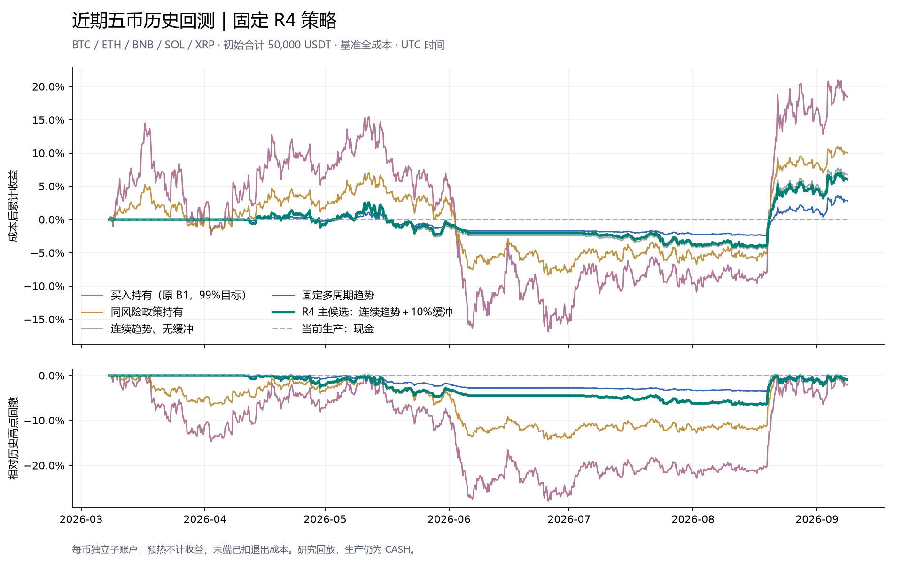

# 当前量化系统：最近六个月五币历史测试

评估区间：2026-03-08T00:00:00+00:00 至 2026-09-08T12:00:00+00:00（UTC，右端不含）。
北京时间为 2026-03-08 08:00 至 2026-09-08 20:00。末根完整4h K线收盘为 19:59:59.999；当前未完成K线不参与。
末端付费平仓参考为2026-09-08北京时间16:00（最后完整K线开盘），最终4小时保持现金；未使用20:00之后的价格。

固定主候选 F3：净收益 **6.07%**，最大回撤 **6.59%**，50,000 USDT 变为 **53,035.49 USDT**。研究结论仍为 `NO_PROVEN_ALPHA`，生产策略仍为 CASH。
缓冲比F2节省费用 94.73 USDT，但最终净利润少 340.84 USDT。8月单月增加4,161.88 USDT，高于全段净利润3,035.49 USDT，利润集中而非稳定逐月增长。

## 固定测试口径

BTC/ETH/BNB/SOL/XRP，各10,000 USDT，子账户独立，无跨币转资，无外部入金；4h决策、下一事件成交、现货LONG/FLAT。评估起点前365天仅用于因果指标预热，不计入收益。F3为此前已固定的主候选，不按本轮赢家重新选择。

F2为连续趋势且无缓冲；F3增加10%数量缓冲；F4固定10/40、20/80、40/160天等权信号预算；F5采用与F3相同的风险、缓冲和成本规则持有市场。每币风险目标20%年化是软目标，不是组合保证。BUY_HOLD复用原B1的99%入场目标，没有风险再平衡；它与低暴露策略承担的风险不同。

没有新收益模型、校准器或标准化器拟合。A3/A7没有近期冻结预测，未伪造预测或暗中重训。F0/F1的旧季度边界诊断不重复；本次重点是当前连续运行版本。

版本身份：本轮开始时冻结的R4，源HEAD为 `d8c6d4013097f6323ab8b7a424c860ba0ccbd62b`。回放期间工作区出现其他策略改动，均予保留；本报告不覆盖这些后续修改。已从 `implementation/` 隔离导入冻结源码，额外180次复现的完整结果与原180个场景逐项一致。21项冻结策略契约测试和8项近期入口测试通过；未将全仓旧测试数量冒充本轮执行数。

## 基准全成本结果

| 配置 | 净收益 | 期末USDT | 最大回撤 | 年化Sharpe | 平均资金暴露 | 闭合交易 | 胜率 | 总成本USDT |
|---|---:|---:|---:|---:|---:|---:|---:|---:|
| 当前生产：现金 | 0.00% | 50,000.00 | 0.00% | — | 0.00% | 0 | — | 0.00 |
| 连续趋势、无缓冲 | 6.75% | 53,376.33 | 6.68% | 1.23 | 19.26% | 15 | 33.33% | 456.74 |
| R4 主候选：连续趋势＋10%缓冲 | 6.07% | 53,035.49 | 6.59% | 1.16 | 18.90% | 15 | 33.33% | 362.02 |
| 固定多周期趋势 | 2.83% | 51,413.42 | 3.45% | 1.01 | 8.84% | 15 | 26.67% | 161.23 |
| 同风险政策持有 | 10.02% | 55,011.42 | 14.32% | 1.04 | 49.02% | 5 | 100.00% | 302.90 |
| 买入持有（原 B1，99%目标） | 18.42% | 59,210.26 | 28.02% | 1.00 | 98.88% | 5 | 100.00% | 166.76 |

Sharpe按完整4h MTM权益计算、零无风险收益；半年年化值仅作诊断。闭合交易指完整flat-to-flat持仓周期，调仓成交不单算交易。

## F3 分币结果

| 币种 | 净收益 | 期末USDT | 最大回撤 | 平均资金暴露 | 闭合交易 | 成本USDT |
|---|---:|---:|---:|---:|---:|---:|
| BTCUSDT | -4.54% | 9,545.73 | 13.73% | 25.34% | 4 | 96.43 |
| ETHUSDT | 11.11% | 11,111.27 | 6.37% | 23.66% | 2 | 60.56 |
| BNBUSDT | 17.56% | 11,756.02 | 9.17% | 23.37% | 3 | 89.22 |
| SOLUSDT | 8.79% | 10,878.54 | 11.82% | 13.03% | 3 | 66.71 |
| XRPUSDT | -2.56% | 9,743.93 | 5.97% | 8.69% | 3 | 49.08 |

## 月度与近期切片

月度从同一连续资金路径切片，不清仓、不重置本金。3月和9月为不完整月份。

| 月份 | F3净收益 | F4净收益 | F5净收益 | 买入持有净收益 |
|---|---:|---:|---:|---:|
| 2026-03 | 0.00% | 0.00% | 0.05% | 1.94% |
| 2026-04 | -0.79% | -0.23% | 1.58% | 4.15% |
| 2026-05 | 0.15% | -0.59% | 0.88% | -0.90% |
| 2026-06 | -1.40% | -0.91% | -10.12% | -19.52% |
| 2026-07 | -1.82% | -0.55% | 2.09% | 6.66% |
| 2026-08 | 8.65% | 3.81% | 15.20% | 28.86% |
| 2026-09 | 1.50% | 1.34% | 1.51% | 1.75% |

| F3连续账户区间 | 区间净收益 | 区间内最大回撤 |
|---|---:|---:|
| 最近6个月 | 6.07% | 6.59% |
| 最近3个月 | 8.28% | 2.29% |
| 最近1个月 | 10.00% | 2.29% |

最近1/3个月保留此前的实际持仓和资金，不代表各自在起点重新投入50,000 USDT的独立回测。

## 成本压力与费用含义

基准单边手续费10 bps，半点差1 bps，滑点底值2 bps＋前一已完成K线NATR项，另计延迟不利1 bps与参与率冲击。现货没有资金费与借币成本。沿用代理精度、最小名义10 USDT及1%参与率上限；没有用当前费率折扣倒填历史。

| 配置 | 0×毛成本诊断 | 0.5× | 1× | 1.5× | 2× |
|---|---:|---:|---:|---:|---:|
| F2 | 7.73% | 7.24% | 6.75% | 6.27% | 5.79% |
| F3 | 6.84% | 6.46% | 6.07% | 5.69% | 5.31% |
| F4 | 3.16% | 2.99% | 2.83% | 2.66% | 2.50% |
| F5 | 10.68% | 10.35% | 10.02% | 9.70% | 9.37% |
| BUY_HOLD | 18.75% | 18.59% | 18.42% | 18.25% | 18.09% |

上表为各成本环境下完整重决策的资金回放，成交路径可能变化，不能把0×与1×的收益差全归为同成交费用。另有1.5×/2×冻结原订单的资金回放（保留拒单与库存约束），以及固定原成交的不可交易影子成本，详见CSV。

## 统计与证据边界

使用原R4共同UTC日轴的10,000次配对区块重采样，保留跨策略、跨币同时相关性；自动区块长度沿用已固定规则。统计只用完整UTC日，末尾半天收益与退出仍计入完整账户结果；统计差额与全段期末差额因此可能不同。

| 事前固定比较 | 日轴复合收益差 | 95%区间 | Holm校正p |
|---|---:|---|---:|
| F3-F2 | -0.71% | [-3.78%, 0.85%] | 1.0000 |
| F4-F3 | -3.27% | [-16.93%, 4.42%] | 1.0000 |
| F3-F5 | -3.95% | [-33.17%, 17.01%] | 1.0000 |
| F4-F5 | -7.22% | [-46.43%, 17.27%] | 1.0000 |
| F3-CASH | 6.14% | [-8.12%, 29.14%] | 1.0000 |

这六个月不是预先封存满12个月的最终留出集。固定存活五币不代表全市场可交易清单；历史账户费率、盘口排队和真实容量未验证。DSR/PBO所需完整独立试验历史仍不齐全，不能用本轮少量配置代替。正收益或单个较好的币种也不能自动证明alpha，亦未改变纸面/实盘准入。

## 验证与可复现材料

完成180次实际引擎运行。逐运行检查成本恒等式、非负现金、LONG/FLAT、权益=现金+持仓市值、严格下一事件成交、末端真实付费退出，以及保存结果重读。组合每个时点必须包含相同五币，累计资金与Decimal账本核对。

每币完整4h时间轴、预热与三周期就绪数量见 `data_quality.json`；来源页及SHA-256在 `source_manifest.json` / `raw/`。官方数据格式见 [Binance Kline 文档](https://developers.binance.com/docs/binance-spot-api-docs/rest-api/market-data-endpoints)。

`runs/`保存完整逐订单、逐成交、仓位、成本、权益与闭合交易JSON及决策追踪；`portfolio_summary.csv`、`per_asset.csv`、`monthly.csv`、`recent_windows.csv`、`same_fill_shadow_summary.csv`提供易读表格。`implementation/`保存运行源码，`effective_config.json`冻结参数与日期。验证记录见 `validation/`。

复现：使用新目录执行 `python -m scripts.run_recent_multi_asset_backtest prepare --output <new-dir>`，随后执行 `run`。精确重放本次日期须使用本目录保存的数据与冻结配置，不能用未来下载的新增日期冒充同一运行。

v1在配置序列化时失败；v2在回放初始化的严格Decimal解析时失败；均发生在引擎运行前，未产生收益试验。原失败目录和日志保留；v3只修正输入序列化适配，没有修改R4策略或引擎。

## 自动本地归档

自动归档退出码2，未生成新提交。裸库 D:\Workspace\git\Personal--Quantitative_Trading.git 仍有 codex-archive 分支。
按 [local-git-remote/SKILL.md](C:/Users/SXD/.codex/skills/local-git-remote/SKILL.md) 的要求：
“已有非 main 归档或未指向 main 的归档 HEAD 必须保留并报错”，本次只停止归档，未迁移或删除历史。
源工作区 main 的并行改动与本轮成果均保留，未提交。完整记录见 validation/local_git_archive.json。
